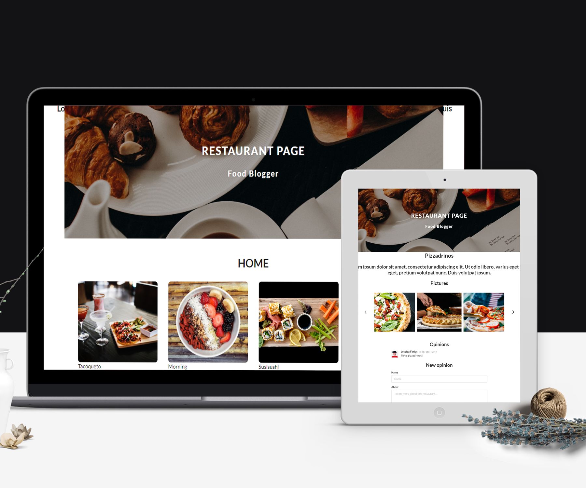

# Tracking app
Tracking your time


[![Contributors][contributors-shield]][contributors-url]
[![Forks][forks-shield]][forks-url]
[![Stargazers][stars-shield]][stars-url]
[![Issues][issues-shield]][issues-url]

<!-- PROJECT LOGO -->
  <h3 align="center">Track</h3>

  <p align="center">
    This is a simple landing page. The user will be able to see the information of the chosen restaurant and make comments on them.<br /></p>
    <h2 align="center">SCREENSHOT</h2>

  <p align="center">
      
  </p>


<!-- ABOUT THE PROJECT -->

## Live Demo
### It's deployed [here](https://focused-ramanujan-35f272.netlify.app/) on netlify


### Built With
This project was built using these technologies.
* React
* JavaScript
* GitHub
* Redux
* Eslint
* Stylelint
* VScode

### Getting Started

To get a local copy up and running follow these simple example steps.

### Prerequisites

 * [Node.js](https://nodejs.org/) is required to install dependencies and run scripts via npm.
 * A modern browser

### Clone
* Clone this repo:
  - Clone with SSH:
  ```
    git@github.com:jessicafarias/restaurant_app.git
  ```
  - Clone with HTTPS
  ```
    https://github.com/jessicafarias/restaurant_app.git
  ```
  - Clone with GitHub CLI
  ```
    gh repo clone jessicafarias/restaurant_app.git
    
 - cd to restaurant_app.git


### Setup

Install dependencies:

```
$ npm install
```

Start the local webserver:

```$ npm start``` will open the project at local webserver at http://localhost:3000/ 


## Authors

## 👤 Jessica Michelle Farías Rosado:
Working as a FullStack developer on this project and UI designer.

 [](https://jessicafarias.github.io/)

 [](https://www.linkedin.com/in/jessica-michelle-farias-rosado/)

 [](mailto:jessica.farias.rosado@gmail.com)
 
 [](https://twitter.com/FariasRosado)


## 🤝 Contributing

Contributions, issues and feature requests are welcome!

Feel free to check the [issues page](https://github.com/jessicafarias/restaurant_app/issues).

## Show your support

Give a :star: if you like this project!


<!-- MARKDOWN LINKS & IMAGES -->
<!-- https://www.markdownguide.org/basic-syntax/#reference-style-links -->
[contributors-shield]: https://img.shields.io/github/contributors/jessicafarias/restaurant_app.svg?style=flat-square
[contributors-url]: https://github.com/jessicafarias/restaurant_app/graphs/contributors
[forks-shield]: https://img.shields.io/github/forks/jessicafarias/restaurant_app.svg?style=flat-square
[forks-url]: https://github.com/jessicafarias/restaurant_app/network/members
[stars-shield]: https://img.shields.io/github/stars/jessicafarias/restaurant_app.svg?style=flat-square
[stars-url]: https://github.com/jessicafarias/restaurant_app/stargazers
[issues-shield]: https://img.shields.io/github/issues/jessicafarias/restaurant_app.svg?style=flat-square
[issues-url]: https://github.com/jessicafarias/restaurant_app/issues

## 📝 License

This project is [MIT](https://opensource.org/licenses/MIT) licensed.


